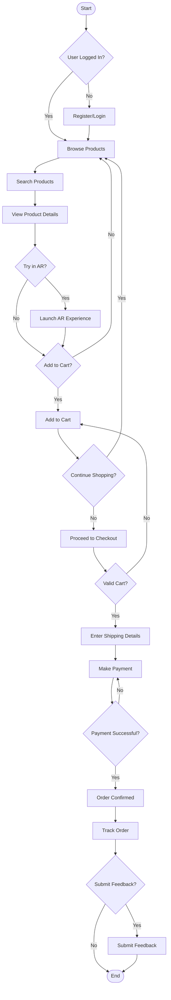
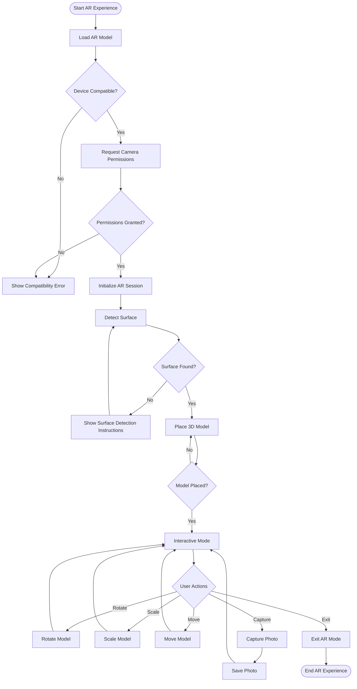
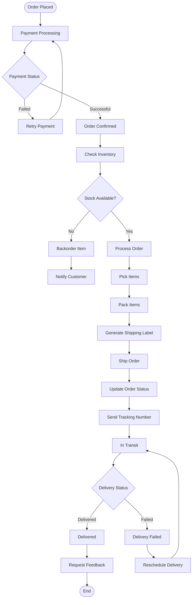
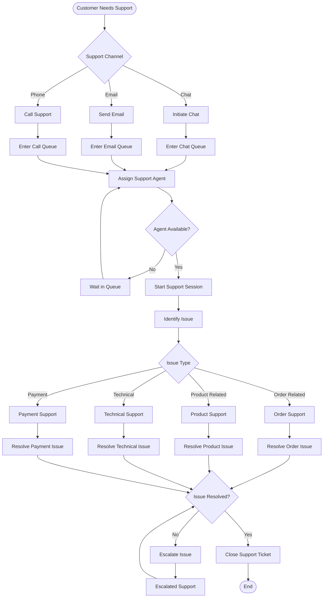
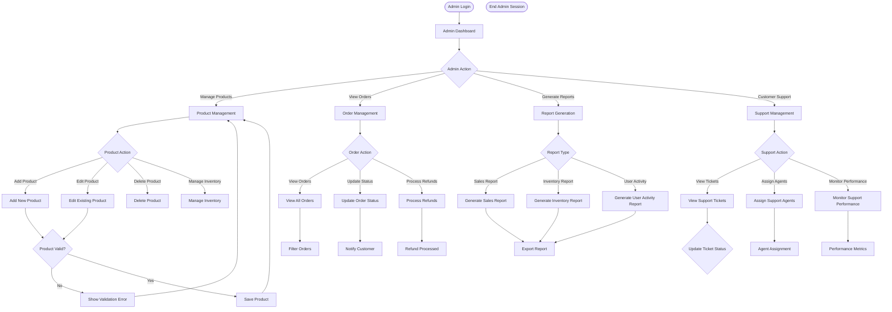

# Activity Diagram - Augmented Reality Shopping App

## Main User Shopping Flow

## AR Try-On Experience Flow

## Order Processing and Tracking Flow

## Customer Support Flow

## Admin Management Flow

## Activity Diagram Description

### Main User Shopping Flow:
- **Authentication**: Registration and login process
- **Product Discovery**: Browsing, searching, and viewing products
- **AR Experience**: Optional AR try-on before purchase
- **Cart Management**: Adding items and managing cart
- **Checkout Process**: Shipping details and payment
- **Post-Purchase**: Order tracking and feedback

### AR Try-On Experience:
- **Device Compatibility**: Checks for AR capabilities
- **Permissions**: Camera and sensor access
- **Surface Detection**: AR plane detection
- **Interactive Mode**: Model manipulation and capture
- **User Controls**: Rotate, scale, move, and capture

### Order Processing:
- **Payment Processing**: Secure transaction handling
- **Inventory Management**: Stock verification and updates
- **Fulfillment**: Picking, packing, and shipping
- **Tracking**: Real-time order status updates
- **Delivery**: Final delivery and feedback collection

### Customer Support:
- **Multi-channel Support**: Chat, email, and phone
- **Queue Management**: Efficient agent assignment
- **Issue Classification**: Categorizing support requests
- **Resolution Process**: Problem-solving and escalation
- **Ticket Management**: Tracking and closing support cases

### Admin Management:
- **Product Management**: CRUD operations for products
- **Order Oversight**: Monitoring and updating orders
- **Reporting**: Analytics and business intelligence
- **Support Coordination**: Managing customer support operations

### Key Decision Points:
- Payment success/failure handling
- Stock availability checks
- Support issue resolution
- Order status transitions
- AR compatibility validation 