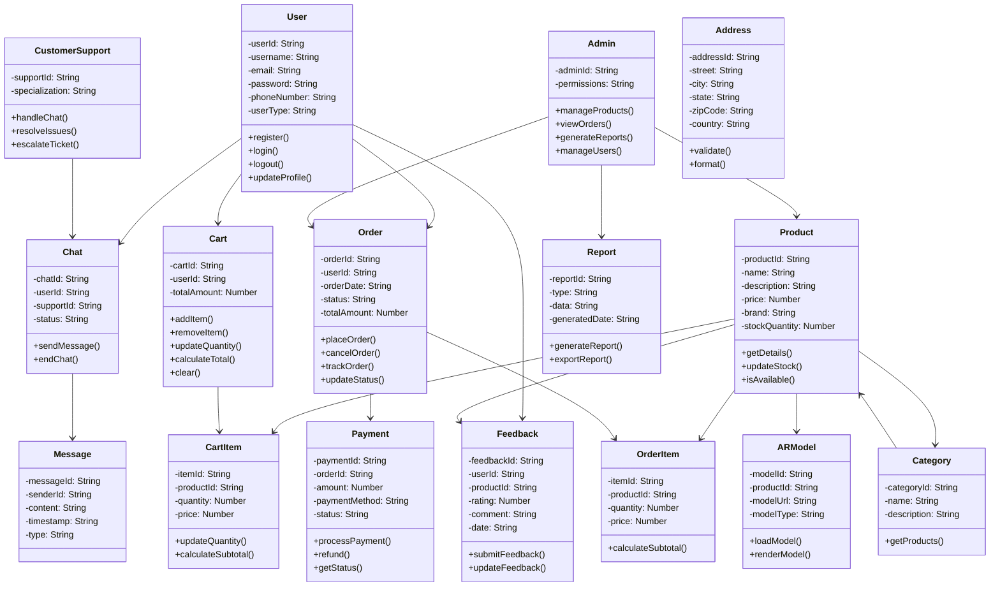

# Class Diagram - Augmented Reality Shopping App

## Class Diagram Description

This class diagram represents the core entities and their relationships in the Augmented Reality Shopping App:

### Main Classes:
- **User**: Represents all users (customers, admins, support)
- **Product**: Products available for purchase with AR capabilities
- **Cart**: Shopping cart functionality
- **Order**: Order management and tracking
- **Payment**: Payment processing
- **Feedback**: User reviews and ratings
- **ARModel**: Augmented reality models for products
- **Chat**: Customer support chat system

### Key Relationships:
- Users can place multiple orders and submit feedback
- Products can be in multiple carts and orders
- Orders are linked to payments
- AR models are associated with products
- Support staff handle customer chats

### Data Types:
- **String**: Text data (IDs, names, descriptions)
- **Number**: Numeric values (prices, quantities, ratings) 
