# Component Diagram - Augmented Reality Shopping App

```mermaid
graph TB
    subgraph "Frontend Layer"
        subgraph "Mobile App"
            MA[Mobile App]
            AR_UI[AR Interface]
            CAMERA[Camera Module]
            SENSORS[Sensor Module]
        end
        
        subgraph "Web Application"
            WA[Web App]
            ADMIN_UI[Admin Dashboard]
            SUPPORT_UI[Support Interface]
        end
    end

    subgraph "API Gateway Layer"
        API_GW[API Gateway]
        AUTH_GW[Authentication Gateway]
        RATE_LIMITER[Rate Limiter]
        LOAD_BALANCER[Load Balancer]
    end

    subgraph "Microservices Layer"
        subgraph "User Management"
            AUTH_SVC[Authentication Service]
            USER_SVC[User Service]
            PROFILE_SVC[Profile Service]
        end
        
        subgraph "Product Management"
            PRODUCT_SVC[Product Service]
            CATALOG_SVC[Catalog Service]
            INVENTORY_SVC[Inventory Service]
            SEARCH_SVC[Search Service]
        end
        
        subgraph "Shopping Experience"
            CART_SVC[Cart Service]
            ORDER_SVC[Order Service]
            PAYMENT_SVC[Payment Service]
            SHIPPING_SVC[Shipping Service]
        end
        
        subgraph "AR & Media"
            AR_SVC[AR Service]
            MEDIA_SVC[Media Service]
            MODEL_SVC[3D Model Service]
        end
        
        subgraph "Support & Communication"
            CHAT_SVC[Chat Service]
            NOTIFICATION_SVC[Notification Service]
            EMAIL_SVC[Email Service]
            SMS_SVC[SMS Service]
        end
        
        subgraph "Analytics & Reporting"
            ANALYTICS_SVC[Analytics Service]
            REPORT_SVC[Report Service]
            FEEDBACK_SVC[Feedback Service]
        end
    end

    subgraph "Data Layer"
        subgraph "Primary Databases"
            USER_DB[(User Database)]
            PRODUCT_DB[(Product Database)]
            ORDER_DB[(Order Database)]
            PAYMENT_DB[(Payment Database)]
        end
        
        subgraph "Specialized Storage"
            AR_STORAGE[(AR Models Storage)]
            MEDIA_STORAGE[(Media Storage)]
            CACHE[(Redis Cache)]
            SEARCH_INDEX[(Elasticsearch)]
        end
    end

    subgraph "External Services"
        PG[Payment Gateway]
        SMTP_PROVIDER[SMTP Provider]
        SMS_PROVIDER[SMS Provider]
        CDN[Content Delivery Network]
        AR_FRAMEWORK[AR Framework]
    end

    %% Frontend to API Gateway connections
    MA --> API_GW
    WA --> API_GW
    ADMIN_UI --> API_GW
    SUPPORT_UI --> API_GW
    AR_UI --> API_GW

    %% API Gateway to services
    API_GW --> AUTH_GW
    API_GW --> RATE_LIMITER
    API_GW --> LOAD_BALANCER

    %% Authentication flow
    AUTH_GW --> AUTH_SVC
    AUTH_SVC --> USER_SVC
    USER_SVC --> PROFILE_SVC

    %% Product management flow
    PRODUCT_SVC --> CATALOG_SVC
    PRODUCT_SVC --> INVENTORY_SVC
    PRODUCT_SVC --> SEARCH_SVC
    SEARCH_SVC --> CATALOG_SVC

    %% Shopping flow
    CART_SVC --> PRODUCT_SVC
    CART_SVC --> INVENTORY_SVC
    ORDER_SVC --> CART_SVC
    ORDER_SVC --> PAYMENT_SVC
    ORDER_SVC --> SHIPPING_SVC
    PAYMENT_SVC --> SHIPPING_SVC

    %% AR and media flow
    AR_SVC --> MODEL_SVC
    AR_SVC --> MEDIA_SVC
    MODEL_SVC --> MEDIA_SVC

    %% Support and communication flow
    CHAT_SVC --> NOTIFICATION_SVC
    NOTIFICATION_SVC --> EMAIL_SVC
    NOTIFICATION_SVC --> SMS_SVC

    %% Analytics flow
    ANALYTICS_SVC --> REPORT_SVC
    FEEDBACK_SVC --> ANALYTICS_SVC

    %% Database connections
    AUTH_SVC --> USER_DB
    USER_SVC --> USER_DB
    PROFILE_SVC --> USER_DB
    
    PRODUCT_SVC --> PRODUCT_DB
    CATALOG_SVC --> PRODUCT_DB
    INVENTORY_SVC --> PRODUCT_DB
    SEARCH_SVC --> SEARCH_INDEX
    
    CART_SVC --> CACHE
    ORDER_SVC --> ORDER_DB
    PAYMENT_SVC --> PAYMENT_DB
    SHIPPING_SVC --> ORDER_DB
    
    AR_SVC --> AR_STORAGE
    MODEL_SVC --> AR_STORAGE
    MEDIA_SVC --> MEDIA_STORAGE
    
    CHAT_SVC --> CACHE
    NOTIFICATION_SVC --> CACHE
    
    ANALYTICS_SVC --> USER_DB
    ANALYTICS_SVC --> PRODUCT_DB
    ANALYTICS_SVC --> ORDER_DB
    REPORT_SVC --> USER_DB
    REPORT_SVC --> PRODUCT_DB
    REPORT_SVC --> ORDER_DB
    FEEDBACK_SVC --> PRODUCT_DB

    %% External service connections
    PAYMENT_SVC --> PG
    EMAIL_SVC --> SMTP_PROVIDER
    SMS_SVC --> SMS_PROVIDER
    MEDIA_SVC --> CDN
    AR_SVC --> AR_FRAMEWORK

    %% Mobile app specific connections
    CAMERA --> AR_UI
    SENSORS --> AR_UI
    AR_UI --> AR_SVC

    %% Component interfaces
    classDef service fill:#e1f5fe
    classDef database fill:#f3e5f5
    classDef external fill:#fff3e0
    classDef frontend fill:#e8f5e8
    classDef gateway fill:#fce4ec

    class AUTH_SVC,USER_SVC,PROFILE_SVC,PRODUCT_SVC,CATALOG_SVC,INVENTORY_SVC,SEARCH_SVC,CART_SVC,ORDER_SVC,PAYMENT_SVC,SHIPPING_SVC,AR_SVC,MEDIA_SVC,MODEL_SVC,CHAT_SVC,NOTIFICATION_SVC,EMAIL_SVC,SMS_SVC,ANALYTICS_SVC,REPORT_SVC,FEEDBACK_SVC service
    class USER_DB,PRODUCT_DB,ORDER_DB,PAYMENT_DB,AR_STORAGE,MEDIA_STORAGE,CACHE,SEARCH_INDEX database
    class PG,SMTP_PROVIDER,SMS_PROVIDER,CDN,AR_FRAMEWORK external
    class MA,AR_UI,CAMERA,SENSORS,WA,ADMIN_UI,SUPPORT_UI frontend
    class API_GW,AUTH_GW,RATE_LIMITER,LOAD_BALANCER gateway
```

## Component Architecture Description

### Frontend Layer:

#### **Mobile Application:**
- **Mobile App**: Main mobile application interface
- **AR Interface**: Augmented reality user interface
- **Camera Module**: Camera access and image processing
- **Sensor Module**: Device sensors (gyroscope, accelerometer)

#### **Web Application:**
- **Web App**: Customer-facing web interface
- **Admin Dashboard**: Administrative management interface
- **Support Interface**: Customer support portal

### API Gateway Layer:
- **API Gateway**: Central entry point for all requests
- **Authentication Gateway**: Handles authentication and authorization
- **Rate Limiter**: Prevents API abuse
- **Load Balancer**: Distributes traffic across services

### Microservices Layer:

#### **User Management Services:**
- **Authentication Service**: User login, registration, JWT management
- **User Service**: User profile and account management
- **Profile Service**: User preferences and settings

#### **Product Management Services:**
- **Product Service**: Product CRUD operations
- **Catalog Service**: Product categorization and organization
- **Inventory Service**: Stock management and availability
- **Search Service**: Product search and filtering

#### **Shopping Experience Services:**
- **Cart Service**: Shopping cart management
- **Order Service**: Order processing and tracking
- **Payment Service**: Payment processing and transactions
- **Shipping Service**: Shipping calculations and tracking

#### **AR & Media Services:**
- **AR Service**: Augmented reality functionality
- **Media Service**: Image and video management
- **3D Model Service**: 3D model storage and retrieval

#### **Support & Communication Services:**
- **Chat Service**: Real-time customer support chat
- **Notification Service**: Push notifications and alerts
- **Email Service**: Email communications
- **SMS Service**: Text message notifications

#### **Analytics & Reporting Services:**
- **Analytics Service**: User behavior and business analytics
- **Report Service**: Business intelligence and reporting
- **Feedback Service**: Customer reviews and ratings

### Data Layer:

#### **Primary Databases:**
- **User Database**: User accounts and profiles
- **Product Database**: Product catalog and inventory
- **Order Database**: Order history and tracking
- **Payment Database**: Payment transactions and history

#### **Specialized Storage:**
- **AR Models Storage**: 3D models for AR experiences
- **Media Storage**: Images, videos, and documents
- **Redis Cache**: Session data and temporary storage
- **Elasticsearch**: Product search and indexing

### External Services:
- **Payment Gateway**: Third-party payment processing
- **SMTP Provider**: Email delivery service
- **SMS Provider**: Text message delivery service
- **Content Delivery Network**: Fast content delivery
- **AR Framework**: Augmented reality SDK

### Key Component Interactions:

1. **User Authentication Flow**: Frontend → API Gateway → Auth Service → User Database
2. **Product Search Flow**: Frontend → API Gateway → Search Service → Elasticsearch
3. **AR Experience Flow**: Mobile App → AR Service → 3D Model Service → AR Storage
4. **Order Processing Flow**: Frontend → Order Service → Payment Service → Payment Gateway
5. **Support Chat Flow**: Frontend → Chat Service → Notification Service → Real-time updates

### Scalability Features:
- **Microservices Architecture**: Independent service scaling
- **Load Balancing**: Traffic distribution
- **Caching**: Redis for performance optimization
- **CDN**: Fast content delivery
- **Database Sharding**: Horizontal scaling capability 