# Component Diagram - Augmented Reality Shopping App

```mermaid
graph TB
    subgraph "Frontend Components"
        subgraph "Mobile Application"
            MA[Mobile App]
            AR_UI[AR Interface]
        end
        
        subgraph "Web Application"
            WA[Web App]
            ADMIN_UI[Admin Dashboard]
            SUPPORT_UI[Support Interface]
        end
    end

    subgraph "API Gateway Components"
        API_GW[API Gateway]
        AUTH_GW[Authentication Gateway]
        RATE_LIMITER[Rate Limiter]
    end

    subgraph "Core Service Components"
        subgraph "User Management"
            AUTH_SVC[Authentication Service]
            USER_SVC[User Service]
        end
        
        subgraph "Product Management"
            PRODUCT_SVC[Product Service]
            SEARCH_SVC[Search Service]
            INVENTORY_SVC[Inventory Service]
        end
        
        subgraph "Shopping Experience"
            CART_SVC[Cart Service]
            ORDER_SVC[Order Service]
            PAYMENT_SVC[Payment Service]
        end
        
        subgraph "AR & Media"
            AR_SVC[AR Service]
            MEDIA_SVC[Media Service]
        end
        
        subgraph "Support & Communication"
            CHAT_SVC[Chat Service]
            NOTIFICATION_SVC[Notification Service]
        end
    end

    subgraph "Data Components"
        subgraph "Primary Databases"
            USER_DB[(User Database)]
            PRODUCT_DB[(Product Database)]
            ORDER_DB[(Order Database)]
            PAYMENT_DB[(Payment Database)]
        end
        
        subgraph "Specialized Storage"
            REDIS[(Redis Cache)]
            ELASTICSEARCH[(Elasticsearch)]
            AR_STORAGE[(AR Storage)]
            MEDIA_STORAGE[(Media Storage)]
        end
    end

    subgraph "External Components"
        PG[Payment Gateway]
        SMTP[Email Service]
        SMS[SMS Service]
        PUSH[Push Notifications]
    end

    %% Frontend to API Gateway connections
    MA --> API_GW
    AR_UI --> API_GW
    WA --> API_GW
    ADMIN_UI --> API_GW
    SUPPORT_UI --> API_GW

    %% API Gateway internal connections
    API_GW --> AUTH_GW
    API_GW --> RATE_LIMITER

    %% API Gateway to Core Services
    AUTH_GW --> AUTH_SVC
    AUTH_GW --> USER_SVC
    API_GW --> PRODUCT_SVC
    API_GW --> SEARCH_SVC
    API_GW --> INVENTORY_SVC
    API_GW --> CART_SVC
    API_GW --> ORDER_SVC
    API_GW --> PAYMENT_SVC
    API_GW --> AR_SVC
    API_GW --> MEDIA_SVC
    API_GW --> CHAT_SVC
    API_GW --> NOTIFICATION_SVC

    %% Service to Database connections
    AUTH_SVC --> USER_DB
    USER_SVC --> USER_DB
    PRODUCT_SVC --> PRODUCT_DB
    SEARCH_SVC --> ELASTICSEARCH
    INVENTORY_SVC --> PRODUCT_DB
    CART_SVC --> REDIS
    ORDER_SVC --> ORDER_DB
    PAYMENT_SVC --> PAYMENT_DB
    AR_SVC --> AR_STORAGE
    MEDIA_SVC --> MEDIA_STORAGE
    CHAT_SVC --> REDIS
    NOTIFICATION_SVC --> REDIS

    %% External service connections
    PAYMENT_SVC --> PG
    NOTIFICATION_SVC --> SMTP
    NOTIFICATION_SVC --> SMS
    NOTIFICATION_SVC --> PUSH

    %% Component styling
    classDef frontend fill:#e8f5e8,stroke:#2e7d32,stroke-width:2px
    classDef gateway fill:#e1f5fe,stroke:#0277bd,stroke-width:2px
    classDef service fill:#f3e5f5,stroke:#7b1fa2,stroke-width:2px
    classDef database fill:#e0f2f1,stroke:#00695c,stroke-width:2px
    classDef external fill:#fafafa,stroke:#424242,stroke-width:2px

    class MA,AR_UI,WA,ADMIN_UI,SUPPORT_UI frontend
    class API_GW,AUTH_GW,RATE_LIMITER gateway
    class AUTH_SVC,USER_SVC,PRODUCT_SVC,SEARCH_SVC,INVENTORY_SVC,CART_SVC,ORDER_SVC,PAYMENT_SVC,AR_SVC,MEDIA_SVC,CHAT_SVC,NOTIFICATION_SVC service
    class USER_DB,PRODUCT_DB,ORDER_DB,PAYMENT_DB,REDIS,ELASTICSEARCH,AR_STORAGE,MEDIA_STORAGE database
    class PG,SMTP,SMS,PUSH external
```

## Component Diagram Description

### **Software Components & Their Interfaces:**

#### **1. Frontend Components**
- **Mobile App**: Main mobile application interface
- **AR Interface**: Augmented reality user interface
- **Web App**: Customer-facing web interface
- **Admin Dashboard**: Administrative management interface
- **Support Interface**: Customer support portal

#### **2. API Gateway Components**
- **API Gateway**: Central entry point for all requests
- **Authentication Gateway**: Handles authentication and authorization
- **Rate Limiter**: Prevents API abuse

#### **3. Core Service Components**

##### **User Management:**
- **Authentication Service**: User login, registration, JWT management
- **User Service**: User profile and account management

##### **Product Management:**
- **Product Service**: Product CRUD operations
- **Search Service**: Product search and filtering
- **Inventory Service**: Stock management and availability

##### **Shopping Experience:**
- **Cart Service**: Shopping cart management
- **Order Service**: Order processing and tracking
- **Payment Service**: Payment processing and transactions

##### **AR & Media:**
- **AR Service**: Augmented reality functionality
- **Media Service**: Image and video management

##### **Support & Communication:**
- **Chat Service**: Real-time customer support chat
- **Notification Service**: Push notifications and alerts

#### **4. Data Components**
- **Primary Databases**: User, Product, Order, Payment data
- **Redis Cache**: Session data and temporary storage
- **Elasticsearch**: Product search and indexing
- **AR Storage**: 3D models for AR experiences
- **Media Storage**: Images, videos, and documents

#### **5. External Components**
- **Payment Gateway**: Third-party payment processing
- **Email Service**: Email delivery service
- **SMS Service**: Text message delivery service
- **Push Notifications**: Mobile push notification service

### **Component Interfaces & Relationships:**

1. **Frontend Components** → **API Gateway Components**
2. **API Gateway Components** → **Core Service Components**
3. **Core Service Components** → **Data Components**
4. **Core Service Components** → **External Components**

### **Key Component Characteristics:**
- **Modular Design**: Each component has a single responsibility
- **Loose Coupling**: Components interact through well-defined interfaces
- **High Cohesion**: Related functionality is grouped together
- **Scalability**: Components can be scaled independently 
