# Component Diagram - Augmented Reality Shopping App

```mermaid
graph TB
    subgraph "Frontend Components"
        subgraph "Mobile Application"
            MA[Mobile App<br/>React Native/Flutter]
            AR_UI[AR Interface<br/>AR Framework Integration]
        end
        
        subgraph "Web Application"
            WA[Web App<br/>React/Angular]
            ADMIN_UI[Admin Dashboard<br/>Management Interface]
            SUPPORT_UI[Support Portal<br/>Customer Service]
        end
    end

    subgraph "API Gateway Layer"
        API_GW[API Gateway<br/>Request Routing & Auth]
        AUTH_GW[Authentication Gateway<br/>JWT & OAuth]
        RATE_LIMITER[Rate Limiter<br/>Request Throttling]
    end

    subgraph "Core Services"
        subgraph "User Management"
            AUTH_SVC[Authentication Service<br/>Login & Registration]
            USER_SVC[User Service<br/>Profile Management]
        end
        
        subgraph "Product Management"
            PRODUCT_SVC[Product Service<br/>Catalog Operations]
            SEARCH_SVC[Search Service<br/>Product Discovery]
            INVENTORY_SVC[Inventory Service<br/>Stock Management]
        end
        
        subgraph "Shopping Experience"
            CART_SVC[Cart Service<br/>Shopping Cart]
            ORDER_SVC[Order Service<br/>Order Processing]
            PAYMENT_SVC[Payment Service<br/>Transaction Handling]
        end
        
        subgraph "AR & Media"
            AR_SVC[AR Service<br/>3D Model Management]
            MEDIA_SVC[Media Service<br/>Image & Video Handling]
        end
        
        subgraph "Support & Communication"
            CHAT_SVC[Chat Service<br/>Real-time Support]
            NOTIFICATION_SVC[Notification Service<br/>Alerts & Messages]
        end
    end

    subgraph "Data Storage"
        subgraph "Primary Databases"
            USER_DB[(User Database<br/>PostgreSQL)]
            PRODUCT_DB[(Product Database<br/>PostgreSQL)]
            ORDER_DB[(Order Database<br/>PostgreSQL)]
            PAYMENT_DB[(Payment Database<br/>PostgreSQL)]
        end
        
        subgraph "Specialized Storage"
            REDIS[(Redis Cache<br/>Session & Cart Data)]
            ELASTICSEARCH[(Elasticsearch<br/>Search Index)]
            AR_STORAGE[(AR Storage<br/>3D Models & Assets)]
            MEDIA_STORAGE[(Media Storage<br/>Images & Videos)]
        end
    end

    subgraph "External Integrations"
        PG[Payment Gateway<br/>Stripe/PayPal]
        SMTP[Email Service<br/>SendGrid/AWS SES]
        SMS[SMS Service<br/>Twilio]
        PUSH[Push Notifications<br/>Firebase/APNS]
    end

    %% Frontend to API Gateway connections
    MA --> API_GW
    AR_UI --> API_GW
    WA --> API_GW
    ADMIN_UI --> API_GW
    SUPPORT_UI --> API_GW

    %% API Gateway internal connections
    API_GW --> AUTH_GW
    API_GW --> RATE_LIMITER

    %% API Gateway to Core Services
    AUTH_GW --> AUTH_SVC
    AUTH_GW --> USER_SVC
    API_GW --> PRODUCT_SVC
    API_GW --> SEARCH_SVC
    API_GW --> INVENTORY_SVC
    API_GW --> CART_SVC
    API_GW --> ORDER_SVC
    API_GW --> PAYMENT_SVC
    API_GW --> AR_SVC
    API_GW --> MEDIA_SVC
    API_GW --> CHAT_SVC
    API_GW --> NOTIFICATION_SVC

    %% Service to Database connections
    AUTH_SVC --> USER_DB
    USER_SVC --> USER_DB
    PRODUCT_SVC --> PRODUCT_DB
    SEARCH_SVC --> ELASTICSEARCH
    INVENTORY_SVC --> PRODUCT_DB
    CART_SVC --> REDIS
    ORDER_SVC --> ORDER_DB
    PAYMENT_SVC --> PAYMENT_DB
    AR_SVC --> AR_STORAGE
    MEDIA_SVC --> MEDIA_STORAGE
    CHAT_SVC --> REDIS
    NOTIFICATION_SVC --> REDIS

    %% External service connections
    PAYMENT_SVC --> PG
    NOTIFICATION_SVC --> SMTP
    NOTIFICATION_SVC --> SMS
    NOTIFICATION_SVC --> PUSH

    %% Component styling
    classDef frontend fill:#e8f5e8,stroke:#2e7d32,stroke-width:2px
    classDef gateway fill:#e1f5fe,stroke:#0277bd,stroke-width:2px
    classDef service fill:#f3e5f5,stroke:#7b1fa2,stroke-width:2px
    classDef database fill:#e0f2f1,stroke:#00695c,stroke-width:2px
    classDef external fill:#fafafa,stroke:#424242,stroke-width:2px

    class MA,AR_UI,WA,ADMIN_UI,SUPPORT_UI frontend
    class API_GW,AUTH_GW,RATE_LIMITER gateway
    class AUTH_SVC,USER_SVC,PRODUCT_SVC,SEARCH_SVC,INVENTORY_SVC,CART_SVC,ORDER_SVC,PAYMENT_SVC,AR_SVC,MEDIA_SVC,CHAT_SVC,NOTIFICATION_SVC service
    class USER_DB,PRODUCT_DB,ORDER_DB,PAYMENT_DB,REDIS,ELASTICSEARCH,AR_STORAGE,MEDIA_STORAGE database
    class PG,SMTP,SMS,PUSH external
```

## Component Architecture Description

### **Software Components & Their Responsibilities:**

#### **1. Frontend Components**
- **Mobile App**: React Native/Flutter application for iOS/Android
- **AR Interface**: AR framework integration (ARKit/ARCore)
- **Web App**: React/Angular web application
- **Admin Dashboard**: Management interface for administrators
- **Support Portal**: Customer service interface

#### **2. API Gateway Layer**
- **API Gateway**: Central entry point, request routing, load balancing
- **Authentication Gateway**: JWT token validation, OAuth integration
- **Rate Limiter**: Request throttling and abuse prevention

#### **3. Core Services (Microservices)**

##### **User Management:**
- **Authentication Service**: User login, registration, password management
- **User Service**: Profile management, user preferences, account settings

##### **Product Management:**
- **Product Service**: Product CRUD operations, catalog management
- **Search Service**: Product search, filtering, recommendations
- **Inventory Service**: Stock management, availability tracking

##### **Shopping Experience:**
- **Cart Service**: Shopping cart operations, item management
- **Order Service**: Order processing, status tracking, fulfillment
- **Payment Service**: Payment processing, transaction management

##### **AR & Media:**
- **AR Service**: 3D model management, AR session handling
- **Media Service**: Image/video processing, storage management

##### **Support & Communication:**
- **Chat Service**: Real-time customer support chat
- **Notification Service**: Email, SMS, push notifications

#### **4. Data Storage**
- **Primary Databases**: PostgreSQL for structured data
- **Redis Cache**: Session data, shopping cart, temporary storage
- **Elasticsearch**: Product search indexing
- **AR Storage**: 3D models and AR assets
- **Media Storage**: Images, videos, documents

#### **5. External Integrations**
- **Payment Gateway**: Stripe/PayPal for payment processing
- **Email Service**: SendGrid/AWS SES for email delivery
- **SMS Service**: Twilio for text messages
- **Push Notifications**: Firebase/APNS for mobile notifications

### **Key Component Interactions:**

1. **Frontend** → **API Gateway** → **Core Services**
2. **Services** → **Databases** (data persistence)
3. **Services** → **External APIs** (third-party integrations)
4. **Authentication** → **All Services** (security)

### **Architecture Benefits:**
- **Modular Design**: Independent, scalable components
- **Technology Flexibility**: Different tech stacks per component
- **Scalability**: Horizontal scaling of individual services
- **Maintainability**: Clear separation of concerns
- **Security**: Centralized authentication and authorization 
