# Deployment Diagram - Augmented Reality Shopping App

```mermaid
graph TB
    subgraph "Client Devices"
        subgraph "Mobile Devices"
            IOS[iOS Devices]
            ANDROID[Android Devices]
            TABLETS[Tablets]
        end
        
        subgraph "Web Clients"
            DESKTOP[Desktop Browsers]
            LAPTOP[Laptop Browsers]
            MOBILE_WEB[Mobile Web Browsers]
        end
    end

    subgraph "CDN & Edge"
        CDN_EDGE[CDN Edge Servers]
        STATIC_ASSETS[Static Assets]
        AR_MODELS[AR Models CDN]
    end

    subgraph "Load Balancer Layer"
        LB_PRIMARY[Primary Load Balancer]
        LB_SECONDARY[Secondary Load Balancer]
        WAF[Web Application Firewall]
    end

    subgraph "API Gateway Cluster"
        subgraph "API Gateway Instances"
            API_GW_1[API Gateway 1]
            API_GW_2[API Gateway 2]
            API_GW_3[API Gateway 3]
        end
        
        subgraph "Gateway Services"
            AUTH_GW[Auth Gateway]
            RATE_LIMITER[Rate Limiter]
            CORS[CORS Handler]
        end
    end

    subgraph "Application Servers"
        subgraph "User Management Cluster"
            AUTH_SVC_1[Auth Service 1]
            AUTH_SVC_2[Auth Service 2]
            USER_SVC_1[User Service 1]
            USER_SVC_2[User Service 2]
        end
        
        subgraph "Product Management Cluster"
            PRODUCT_SVC_1[Product Service 1]
            PRODUCT_SVC_2[Product Service 2]
            SEARCH_SVC_1[Search Service 1]
            SEARCH_SVC_2[Search Service 2]
            INVENTORY_SVC_1[Inventory Service 1]
            INVENTORY_SVC_2[Inventory Service 2]
        end
        
        subgraph "Shopping Cluster"
            CART_SVC_1[Cart Service 1]
            CART_SVC_2[Cart Service 2]
            ORDER_SVC_1[Order Service 1]
            ORDER_SVC_2[Order Service 2]
            PAYMENT_SVC_1[Payment Service 1]
            PAYMENT_SVC_2[Payment Service 2]
        end
        
        subgraph "AR & Media Cluster"
            AR_SVC_1[AR Service 1]
            AR_SVC_2[AR Service 2]
            MEDIA_SVC_1[Media Service 1]
            MEDIA_SVC_2[Media Service 2]
        end
        
        subgraph "Support Cluster"
            CHAT_SVC_1[Chat Service 1]
            CHAT_SVC_2[Chat Service 2]
            NOTIFICATION_SVC_1[Notification Service 1]
            NOTIFICATION_SVC_2[Notification Service 2]
        end
        
        subgraph "Analytics Cluster"
            ANALYTICS_SVC_1[Analytics Service 1]
            ANALYTICS_SVC_2[Analytics Service 2]
            REPORT_SVC_1[Report Service 1]
            REPORT_SVC_2[Report Service 2]
        end
    end

    subgraph "Database Layer"
        subgraph "Primary Database Cluster"
            USER_DB_MASTER[(User DB Master)]
            USER_DB_SLAVE_1[(User DB Slave 1)]
            USER_DB_SLAVE_2[(User DB Slave 2)]
            
            PRODUCT_DB_MASTER[(Product DB Master)]
            PRODUCT_DB_SLAVE_1[(Product DB Slave 1)]
            PRODUCT_DB_SLAVE_2[(Product DB Slave 2)]
            
            ORDER_DB_MASTER[(Order DB Master)]
            ORDER_DB_SLAVE_1[(Order DB Slave 1)]
            ORDER_DB_SLAVE_2[(Order DB Slave 2)]
            
            PAYMENT_DB_MASTER[(Payment DB Master)]
            PAYMENT_DB_SLAVE_1[(Payment DB Slave 1)]
            PAYMENT_DB_SLAVE_2[(Payment DB Slave 2)]
        end
        
        subgraph "Specialized Storage"
            REDIS_CLUSTER[(Redis Cluster)]
            ELASTICSEARCH_CLUSTER[(Elasticsearch Cluster)]
            AR_STORAGE_CLUSTER[(AR Storage Cluster)]
            MEDIA_STORAGE_CLUSTER[(Media Storage Cluster)]
        end
    end

    subgraph "External Services"
        PG[Payment Gateway]
        SMTP[SMTP Provider]
        SMS[SMS Provider]
        PUSH_NOTIFICATIONS[Push Notification Service]
    end

    subgraph "Monitoring & Logging"
        MONITORING[Monitoring System]
        LOGGING[Logging System]
        ALERTING[Alerting System]
    end

    %% Client to CDN connections
    IOS --> CDN_EDGE
    ANDROID --> CDN_EDGE
    TABLETS --> CDN_EDGE
    DESKTOP --> CDN_EDGE
    LAPTOP --> CDN_EDGE
    MOBILE_WEB --> CDN_EDGE

    %% CDN to Load Balancer
    CDN_EDGE --> LB_PRIMARY
    CDN_EDGE --> LB_SECONDARY
    LB_PRIMARY --> WAF
    LB_SECONDARY --> WAF

    %% Load Balancer to API Gateway
    WAF --> API_GW_1
    WAF --> API_GW_2
    WAF --> API_GW_3

    %% API Gateway internal connections
    API_GW_1 --> AUTH_GW
    API_GW_2 --> AUTH_GW
    API_GW_3 --> AUTH_GW
    API_GW_1 --> RATE_LIMITER
    API_GW_2 --> RATE_LIMITER
    API_GW_3 --> RATE_LIMITER
    API_GW_1 --> CORS
    API_GW_2 --> CORS
    API_GW_3 --> CORS

    %% API Gateway to Services
    AUTH_GW --> AUTH_SVC_1
    AUTH_GW --> AUTH_SVC_2
    AUTH_GW --> USER_SVC_1
    AUTH_GW --> USER_SVC_2

    %% Service to Service connections
    AUTH_SVC_1 --> USER_SVC_1
    AUTH_SVC_2 --> USER_SVC_2
    USER_SVC_1 --> PRODUCT_SVC_1
    USER_SVC_2 --> PRODUCT_SVC_2

    %% Product Management connections
    PRODUCT_SVC_1 --> SEARCH_SVC_1
    PRODUCT_SVC_2 --> SEARCH_SVC_2
    PRODUCT_SVC_1 --> INVENTORY_SVC_1
    PRODUCT_SVC_2 --> INVENTORY_SVC_2

    %% Shopping connections
    CART_SVC_1 --> PRODUCT_SVC_1
    CART_SVC_2 --> PRODUCT_SVC_2
    ORDER_SVC_1 --> CART_SVC_1
    ORDER_SVC_2 --> CART_SVC_2
    ORDER_SVC_1 --> PAYMENT_SVC_1
    ORDER_SVC_2 --> PAYMENT_SVC_2

    %% AR and Media connections
    AR_SVC_1 --> MEDIA_SVC_1
    AR_SVC_2 --> MEDIA_SVC_2

    %% Support connections
    CHAT_SVC_1 --> NOTIFICATION_SVC_1
    CHAT_SVC_2 --> NOTIFICATION_SVC_2

    %% Database connections
    AUTH_SVC_1 --> USER_DB_MASTER
    AUTH_SVC_2 --> USER_DB_MASTER
    USER_SVC_1 --> USER_DB_SLAVE_1
    USER_SVC_2 --> USER_DB_SLAVE_2

    PRODUCT_SVC_1 --> PRODUCT_DB_MASTER
    PRODUCT_SVC_2 --> PRODUCT_DB_MASTER
    SEARCH_SVC_1 --> ELASTICSEARCH_CLUSTER
    SEARCH_SVC_2 --> ELASTICSEARCH_CLUSTER

    CART_SVC_1 --> REDIS_CLUSTER
    CART_SVC_2 --> REDIS_CLUSTER
    ORDER_SVC_1 --> ORDER_DB_MASTER
    ORDER_SVC_2 --> ORDER_DB_MASTER
    PAYMENT_SVC_1 --> PAYMENT_DB_MASTER
    PAYMENT_SVC_2 --> PAYMENT_DB_MASTER

    AR_SVC_1 --> AR_STORAGE_CLUSTER
    AR_SVC_2 --> AR_STORAGE_CLUSTER
    MEDIA_SVC_1 --> MEDIA_STORAGE_CLUSTER
    MEDIA_SVC_2 --> MEDIA_STORAGE_CLUSTER

    CHAT_SVC_1 --> REDIS_CLUSTER
    CHAT_SVC_2 --> REDIS_CLUSTER

    %% External service connections
    PAYMENT_SVC_1 --> PG
    PAYMENT_SVC_2 --> PG
    NOTIFICATION_SVC_1 --> SMTP
    NOTIFICATION_SVC_2 --> SMTP
    NOTIFICATION_SVC_1 --> SMS
    NOTIFICATION_SVC_2 --> SMS
    NOTIFICATION_SVC_1 --> PUSH_NOTIFICATIONS
    NOTIFICATION_SVC_2 --> PUSH_NOTIFICATIONS

    %% Monitoring connections
    MONITORING --> AUTH_SVC_1
    MONITORING --> AUTH_SVC_2
    MONITORING --> PRODUCT_SVC_1
    MONITORING --> PRODUCT_SVC_2
    MONITORING --> ORDER_SVC_1
    MONITORING --> ORDER_SVC_2
    LOGGING --> AUTH_SVC_1
    LOGGING --> AUTH_SVC_2
    LOGGING --> PRODUCT_SVC_1
    LOGGING --> PRODUCT_SVC_2
    LOGGING --> ORDER_SVC_1
    LOGGING --> ORDER_SVC_2

    %% Database replication
    USER_DB_MASTER -.-> USER_DB_SLAVE_1
    USER_DB_MASTER -.-> USER_DB_SLAVE_2
    PRODUCT_DB_MASTER -.-> PRODUCT_DB_SLAVE_1
    PRODUCT_DB_MASTER -.-> PRODUCT_DB_SLAVE_2
    ORDER_DB_MASTER -.-> ORDER_DB_SLAVE_1
    ORDER_DB_MASTER -.-> ORDER_DB_SLAVE_2
    PAYMENT_DB_MASTER -.-> PAYMENT_DB_SLAVE_1
    PAYMENT_DB_MASTER -.-> PAYMENT_DB_SLAVE_2

    %% Component styling
    classDef client fill:#e8f5e8
    classDef cdn fill:#fff3e0
    classDef loadbalancer fill:#fce4ec
    classDef gateway fill:#e1f5fe
    classDef service fill:#f3e5f5
    classDef database fill:#e0f2f1
    classDef external fill:#fafafa
    classDef monitoring fill:#fff8e1

    class IOS,ANDROID,TABLETS,DESKTOP,LAPTOP,MOBILE_WEB client
    class CDN_EDGE,STATIC_ASSETS,AR_MODELS cdn
    class LB_PRIMARY,LB_SECONDARY,WAF loadbalancer
    class API_GW_1,API_GW_2,API_GW_3,AUTH_GW,RATE_LIMITER,CORS gateway
    class AUTH_SVC_1,AUTH_SVC_2,USER_SVC_1,USER_SVC_2,PRODUCT_SVC_1,PRODUCT_SVC_2,SEARCH_SVC_1,SEARCH_SVC_2,INVENTORY_SVC_1,INVENTORY_SVC_2,CART_SVC_1,CART_SVC_2,ORDER_SVC_1,ORDER_SVC_2,PAYMENT_SVC_1,PAYMENT_SVC_2,AR_SVC_1,AR_SVC_2,MEDIA_SVC_1,MEDIA_SVC_2,CHAT_SVC_1,CHAT_SVC_2,NOTIFICATION_SVC_1,NOTIFICATION_SVC_2,ANALYTICS_SVC_1,ANALYTICS_SVC_2,REPORT_SVC_1,REPORT_SVC_2 service
    class USER_DB_MASTER,USER_DB_SLAVE_1,USER_DB_SLAVE_2,PRODUCT_DB_MASTER,PRODUCT_DB_SLAVE_1,PRODUCT_DB_SLAVE_2,ORDER_DB_MASTER,ORDER_DB_SLAVE_1,ORDER_DB_SLAVE_2,PAYMENT_DB_MASTER,PAYMENT_DB_SLAVE_1,PAYMENT_DB_SLAVE_2,REDIS_CLUSTER,ELASTICSEARCH_CLUSTER,AR_STORAGE_CLUSTER,MEDIA_STORAGE_CLUSTER database
    class PG,SMTP,SMS,PUSH_NOTIFICATIONS external
    class MONITORING,LOGGING,ALERTING monitoring
```

## Deployment Architecture Description

### Client Devices:

#### **Mobile Devices:**
- **iOS Devices**: iPhones and iPads with AR capabilities
- **Android Devices**: Android phones and tablets with AR support
- **Tablets**: Large-screen devices for enhanced AR experience

#### **Web Clients:**
- **Desktop Browsers**: Full-featured web interface
- **Laptop Browsers**: Portable web access
- **Mobile Web Browsers**: Web access on mobile devices

### CDN & Edge Layer:
- **CDN Edge Servers**: Global content delivery for fast access
- **Static Assets**: Images, CSS, JavaScript files
- **AR Models CDN**: Distributed 3D model delivery

### Load Balancer Layer:
- **Primary Load Balancer**: Main traffic distribution
- **Secondary Load Balancer**: Failover and redundancy
- **Web Application Firewall**: Security and DDoS protection

### API Gateway Cluster:
- **API Gateway Instances**: Multiple instances for high availability
- **Auth Gateway**: Centralized authentication
- **Rate Limiter**: API usage control
- **CORS Handler**: Cross-origin resource sharing

### Application Servers:

#### **User Management Cluster:**
- **Auth Service**: Authentication and authorization (2 instances)
- **User Service**: User profile management (2 instances)

#### **Product Management Cluster:**
- **Product Service**: Product operations (2 instances)
- **Search Service**: Product search (2 instances)
- **Inventory Service**: Stock management (2 instances)

#### **Shopping Cluster:**
- **Cart Service**: Shopping cart (2 instances)
- **Order Service**: Order processing (2 instances)
- **Payment Service**: Payment handling (2 instances)

#### **AR & Media Cluster:**
- **AR Service**: Augmented reality (2 instances)
- **Media Service**: Media management (2 instances)

#### **Support Cluster:**
- **Chat Service**: Customer support (2 instances)
- **Notification Service**: Notifications (2 instances)

#### **Analytics Cluster:**
- **Analytics Service**: Data analysis (2 instances)
- **Report Service**: Reporting (2 instances)

### Database Layer:

#### **Primary Database Cluster:**
- **User Database**: Master-slave replication (1 master, 2 slaves)
- **Product Database**: Master-slave replication (1 master, 2 slaves)
- **Order Database**: Master-slave replication (1 master, 2 slaves)
- **Payment Database**: Master-slave replication (1 master, 2 slaves)

#### **Specialized Storage:**
- **Redis Cluster**: Session data and caching
- **Elasticsearch Cluster**: Product search indexing
- **AR Storage Cluster**: 3D model storage
- **Media Storage Cluster**: Image and video storage

### External Services:
- **Payment Gateway**: Third-party payment processing
- **SMTP Provider**: Email delivery
- **SMS Provider**: Text message delivery
- **Push Notification Service**: Mobile push notifications

### Monitoring & Logging:
- **Monitoring System**: Performance and health monitoring
- **Logging System**: Centralized log collection
- **Alerting System**: Automated alerts and notifications

### Deployment Features:

#### **High Availability:**
- Multiple service instances
- Load balancer redundancy
- Database master-slave replication
- CDN edge distribution

#### **Scalability:**
- Horizontal scaling of services
- Database read replicas
- Caching layers
- Auto-scaling capabilities

#### **Security:**
- Web Application Firewall
- API rate limiting
- Secure database connections
- External service authentication

#### **Performance:**
- CDN for static content
- Redis caching
- Database optimization
- Load balancing

#### **Monitoring:**
- Real-time performance monitoring
- Centralized logging
- Automated alerting
- Health checks

### Deployment Considerations:

1. **Geographic Distribution**: CDN edge servers for global access
2. **Fault Tolerance**: Multiple instances and failover mechanisms
3. **Data Consistency**: Master-slave database replication
4. **Security**: WAF, rate limiting, and secure connections
5. **Performance**: Caching, load balancing, and optimized storage
6. **Monitoring**: Comprehensive observability and alerting 