# Deployment Diagram - Augmented Reality Shopping App

```mermaid
graph TB
    subgraph "Client Layer"
        subgraph "Mobile Devices"
            IOS[iOS Devices<br/>Mobile App + AR Interface]
            ANDROID[Android Devices<br/>Mobile App + AR Interface]
        end
        
        subgraph "Web Clients"
            DESKTOP[Desktop/Laptop<br/>Web Browser]
            MOBILE_WEB[Mobile Web<br/>Browser]
        end
    end

    subgraph "Edge Layer"
        CDN[CDN Edge Servers<br/>Static Assets + AR Models]
    end

    subgraph "Load Balancer Layer"
        LB[Load Balancer<br/>Traffic Distribution + WAF]
    end

    subgraph "Application Layer"
        subgraph "API Gateway Cluster"
            API_GW[API Gateway<br/>Authentication + Rate Limiting]
        end
        
        subgraph "Microservices Cluster"
            subgraph "User Services"
                AUTH_SVC[Auth Service<br/>User Authentication]
                USER_SVC[User Service<br/>Profile Management]
            end
            
            subgraph "Product Services"
                PRODUCT_SVC[Product Service<br/>Catalog Management]
                SEARCH_SVC[Search Service<br/>Product Search]
                INVENTORY_SVC[Inventory Service<br/>Stock Management]
            end
            
            subgraph "Shopping Services"
                CART_SVC[Cart Service<br/>Shopping Cart]
                ORDER_SVC[Order Service<br/>Order Processing]
                PAYMENT_SVC[Payment Service<br/>Payment Processing]
            end
            
            subgraph "AR Services"
                AR_SVC[AR Service<br/>Augmented Reality]
                MEDIA_SVC[Media Service<br/>Media Management]
            end
            
            subgraph "Support Services"
                CHAT_SVC[Chat Service<br/>Customer Support]
                NOTIFICATION_SVC[Notification Service<br/>Alerts & Emails]
            end
        end
    end

    subgraph "Data Layer"
        subgraph "Primary Databases"
            USER_DB[(User Database<br/>User Accounts & Profiles)]
            PRODUCT_DB[(Product Database<br/>Product Catalog)]
            ORDER_DB[(Order Database<br/>Orders & Tracking)]
            PAYMENT_DB[(Payment Database<br/>Transactions)]
        end
        
        subgraph "Specialized Storage"
            REDIS[(Redis Cache<br/>Sessions & Cart Data)]
            ELASTICSEARCH[(Elasticsearch<br/>Product Search Index)]
            AR_STORAGE[(AR Storage<br/>3D Models & Assets)]
            MEDIA_STORAGE[(Media Storage<br/>Images & Videos)]
        end
    end

    subgraph "External Services"
        PG[Payment Gateway<br/>Stripe/PayPal]
        SMTP[SMTP Provider<br/>Email Service]
        SMS[SMS Provider<br/>Text Messages]
        PUSH[Push Service<br/>Mobile Notifications]
    end

    subgraph "Monitoring Layer"
        MONITORING[Monitoring System<br/>Performance & Health]
        LOGGING[Logging System<br/>Centralized Logs]
    end

    %% Client to Edge connections
    IOS --> CDN
    ANDROID --> CDN
    DESKTOP --> CDN
    MOBILE_WEB --> CDN

    %% Edge to Load Balancer
    CDN --> LB

    %% Load Balancer to API Gateway
    LB --> API_GW

    %% API Gateway to Services
    API_GW --> AUTH_SVC
    API_GW --> USER_SVC
    API_GW --> PRODUCT_SVC
    API_GW --> SEARCH_SVC
    API_GW --> INVENTORY_SVC
    API_GW --> CART_SVC
    API_GW --> ORDER_SVC
    API_GW --> PAYMENT_SVC
    API_GW --> AR_SVC
    API_GW --> MEDIA_SVC
    API_GW --> CHAT_SVC
    API_GW --> NOTIFICATION_SVC

    %% Service to Database connections
    AUTH_SVC --> USER_DB
    USER_SVC --> USER_DB
    PRODUCT_SVC --> PRODUCT_DB
    SEARCH_SVC --> ELASTICSEARCH
    INVENTORY_SVC --> PRODUCT_DB
    CART_SVC --> REDIS
    ORDER_SVC --> ORDER_DB
    PAYMENT_SVC --> PAYMENT_DB
    AR_SVC --> AR_STORAGE
    MEDIA_SVC --> MEDIA_STORAGE
    CHAT_SVC --> REDIS
    NOTIFICATION_SVC --> REDIS

    %% External service connections
    PAYMENT_SVC --> PG
    NOTIFICATION_SVC --> SMTP
    NOTIFICATION_SVC --> SMS
    NOTIFICATION_SVC --> PUSH

    %% Monitoring connections
    MONITORING --> AUTH_SVC
    MONITORING --> PRODUCT_SVC
    MONITORING --> ORDER_SVC
    LOGGING --> AUTH_SVC
    LOGGING --> PRODUCT_SVC
    LOGGING --> ORDER_SVC

    %% Component styling
    classDef client fill:#e8f5e8,stroke:#2e7d32,stroke-width:2px
    classDef edge fill:#fff3e0,stroke:#f57c00,stroke-width:2px
    classDef loadbalancer fill:#fce4ec,stroke:#c2185b,stroke-width:2px
    classDef gateway fill:#e1f5fe,stroke:#0277bd,stroke-width:2px
    classDef service fill:#f3e5f5,stroke:#7b1fa2,stroke-width:2px
    classDef database fill:#e0f2f1,stroke:#00695c,stroke-width:2px
    classDef external fill:#fafafa,stroke:#424242,stroke-width:2px
    classDef monitoring fill:#fff8e1,stroke:#f57f17,stroke-width:2px

    class IOS,ANDROID,DESKTOP,MOBILE_WEB client
    class CDN edge
    class LB loadbalancer
    class API_GW gateway
    class AUTH_SVC,USER_SVC,PRODUCT_SVC,SEARCH_SVC,INVENTORY_SVC,CART_SVC,ORDER_SVC,PAYMENT_SVC,AR_SVC,MEDIA_SVC,CHAT_SVC,NOTIFICATION_SVC service
    class USER_DB,PRODUCT_DB,ORDER_DB,PAYMENT_DB,REDIS,ELASTICSEARCH,AR_STORAGE,MEDIA_STORAGE database
    class PG,SMTP,SMS,PUSH external
    class MONITORING,LOGGING monitoring
```

## Deployment Architecture Description

### **Hardware Nodes & Software Deployment:**

#### **1. Client Layer (End User Devices)**
- **iOS Devices**: Mobile App + AR Interface
- **Android Devices**: Mobile App + AR Interface  
- **Desktop/Laptop**: Web Browser
- **Mobile Web**: Browser-based access

#### **2. Edge Layer (CDN)**
- **CDN Edge Servers**: Static assets, AR models, global content delivery

#### **3. Load Balancer Layer**
- **Load Balancer**: Traffic distribution, Web Application Firewall (WAF)

#### **4. Application Layer**
- **API Gateway Cluster**: Authentication, rate limiting, request routing
- **Microservices Cluster**: 
  - **User Services**: Authentication & profile management
  - **Product Services**: Catalog, search, inventory
  - **Shopping Services**: Cart, orders, payments
  - **AR Services**: Augmented reality & media
  - **Support Services**: Chat & notifications

#### **5. Data Layer**
- **Primary Databases**: User, Product, Order, Payment data
- **Specialized Storage**: Cache, search index, AR models, media files

#### **6. External Services**
- **Payment Gateway**: Third-party payment processing
- **Communication Services**: Email, SMS, push notifications

#### **7. Monitoring Layer**
- **Monitoring System**: Performance & health tracking
- **Logging System**: Centralized log collection

### **Data Flow:**
1. **Client** → **CDN** → **Load Balancer** → **API Gateway**
2. **API Gateway** → **Microservices** → **Databases**
3. **Services** → **External APIs** (payment, communication)
4. **Monitoring** → **All Services** (health checks & logging)

### **Key Features:**
- **Clear separation** of hardware nodes and software components
- **Scalable architecture** with multiple service instances
- **High availability** with load balancing and redundancy
- **Security** with WAF and authentication layers
- **Performance** with CDN and caching

### Deployment Features:

#### **High Availability:**
- Multiple service instances
- Load balancer redundancy
- Database master-slave replication
- CDN edge distribution

#### **Scalability:**
- Horizontal scaling of services
- Database read replicas
- Caching layers
- Auto-scaling capabilities

#### **Security:**
- Web Application Firewall
- API rate limiting
- Secure database connections
- External service authentication

#### **Performance:**
- CDN for static content
- Redis caching
- Database optimization
- Load balancing

#### **Monitoring:**
- Real-time performance monitoring
- Centralized logging
- Automated alerting
- Health checks

### Deployment Considerations:

1. **Geographic Distribution**: CDN edge servers for global access
2. **Fault Tolerance**: Multiple instances and failover mechanisms
3. **Data Consistency**: Master-slave database replication
4. **Security**: WAF, rate limiting, and secure connections
5. **Performance**: Caching, load balancing, and optimized storage
6. **Monitoring**: Comprehensive observability and alerting 
