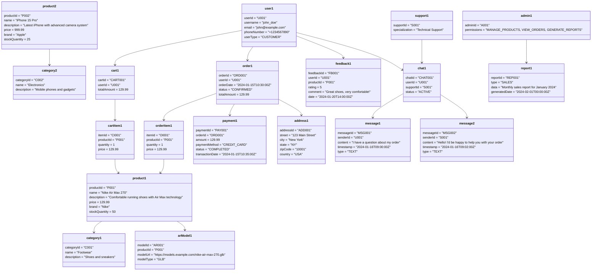

# Object Diagram - Augmented Reality Shopping App

## Object Diagram Description

This object diagram shows specific instances of the classes with their actual attribute values:

### Key Instances:
- **User**: John Doe (customer)
- **Admin**: Admin with product management permissions
- **Support**: Technical support specialist
- **Products**: Nike shoes and iPhone with specific details
- **Order**: A confirmed order for Nike shoes
- **Payment**: Completed credit card payment
- **Chat**: Active support conversation

### Instance Relationships:
- User John has a cart with Nike shoes
- The order is linked to payment and shipping address
- Support staff is handling the customer's chat
- Products are categorized and have AR models
- Feedback is submitted for the purchased product

### Real-world Values:
- Actual prices, IDs, and timestamps
- Realistic product names and descriptions
- Proper relationships between instances 
