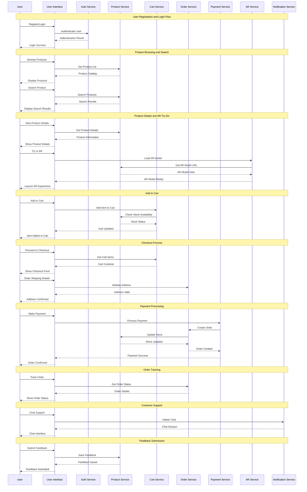
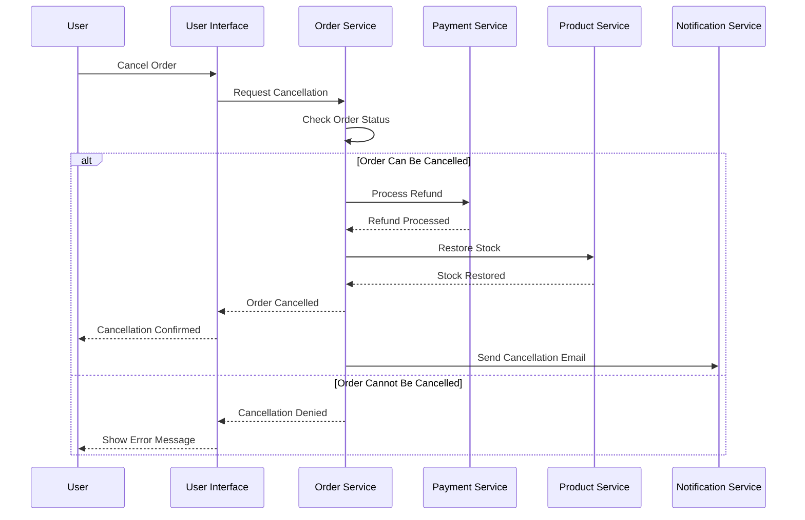
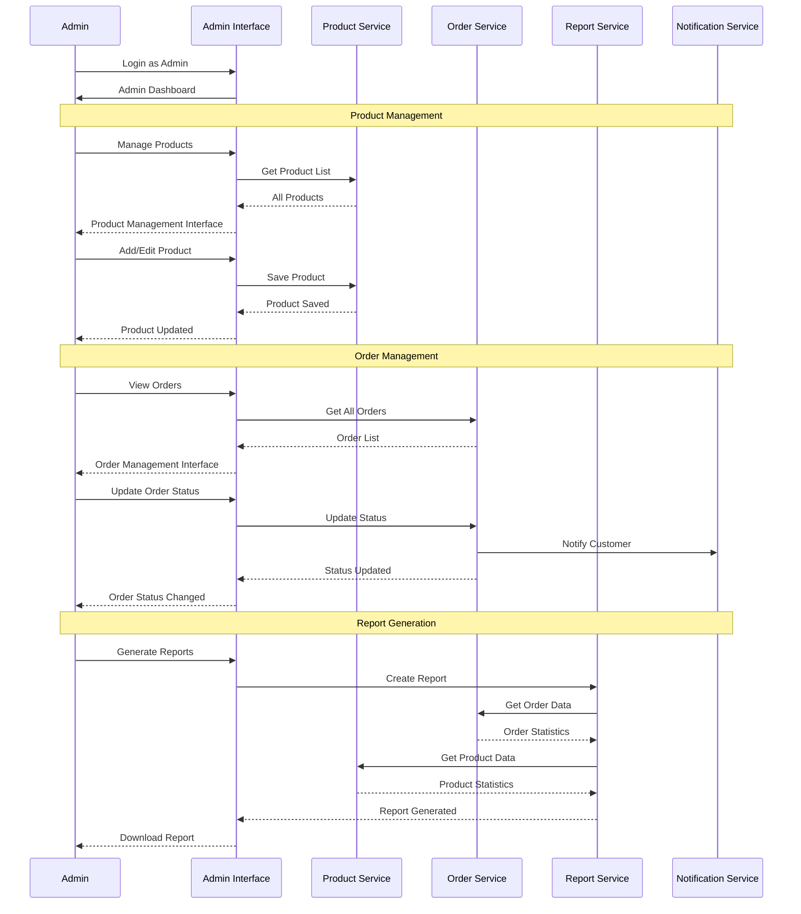

# Sequence Diagram - Augmented Reality Shopping App

## Main Purchase Flow with AR Try-On

## Order Cancellation Flow

## Admin Management Flow

## Sequence Diagram Description

### Main Purchase Flow:
1. **Authentication**: User registers/logs in
2. **Product Discovery**: Browse and search products
3. **AR Experience**: Try products in augmented reality
4. **Cart Management**: Add items to cart
5. **Checkout**: Complete purchase with payment
6. **Order Tracking**: Monitor order status
7. **Support**: Access customer support when needed
8. **Feedback**: Submit product reviews

### Key Interactions:
- **AR Service**: Handles 3D model loading and rendering
- **Payment Service**: Processes transactions securely
- **Order Service**: Manages order lifecycle
- **Notification Service**: Sends updates to users
- **Product Service**: Manages inventory and product data

### Error Handling:
- Stock availability checks
- Payment validation
- Order cancellation rules
- Address validation

### Admin Functions:
- Product management
- Order oversight
- Report generation
- Customer support coordination 