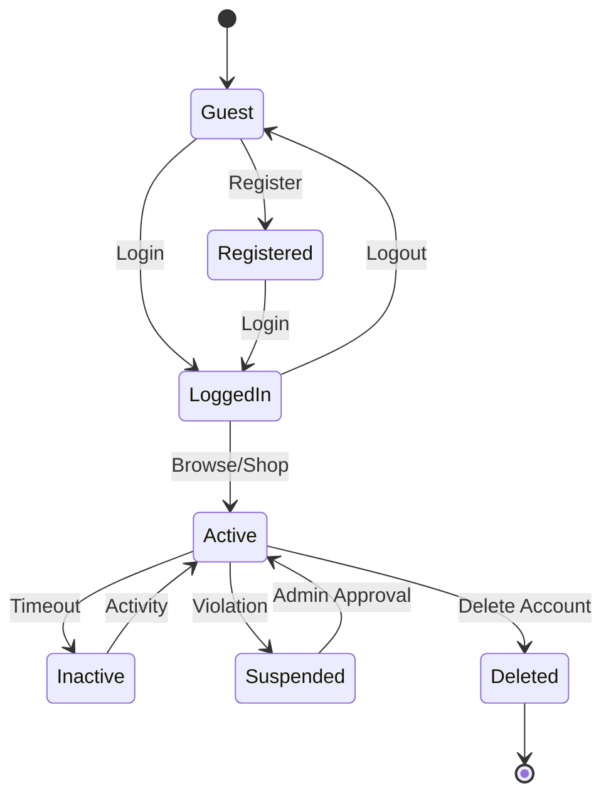
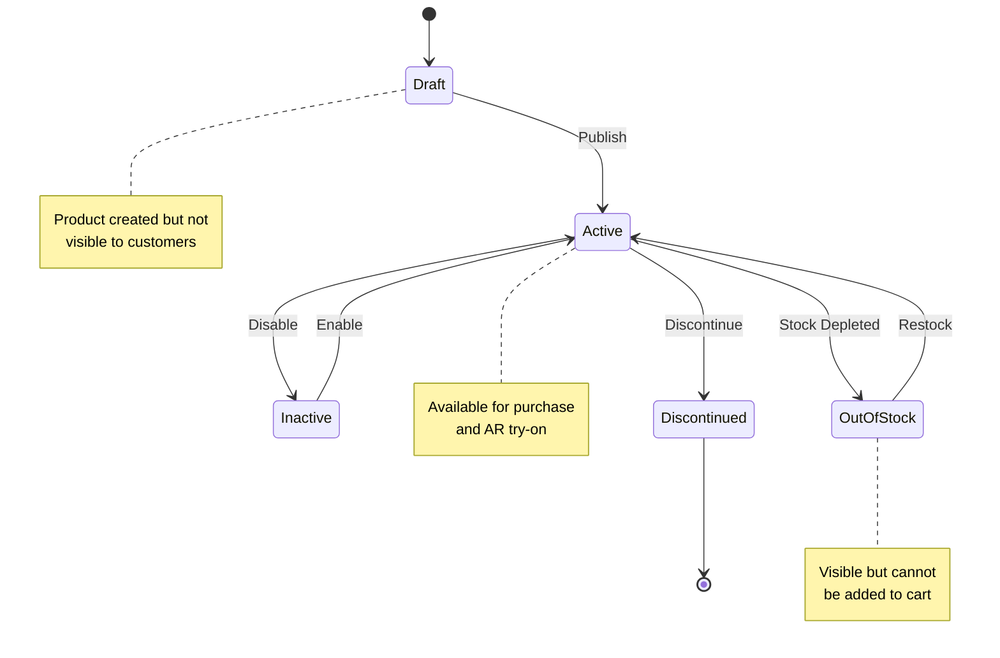
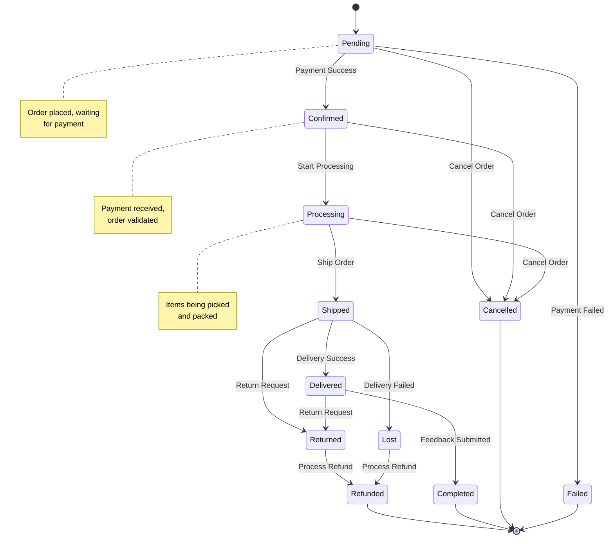
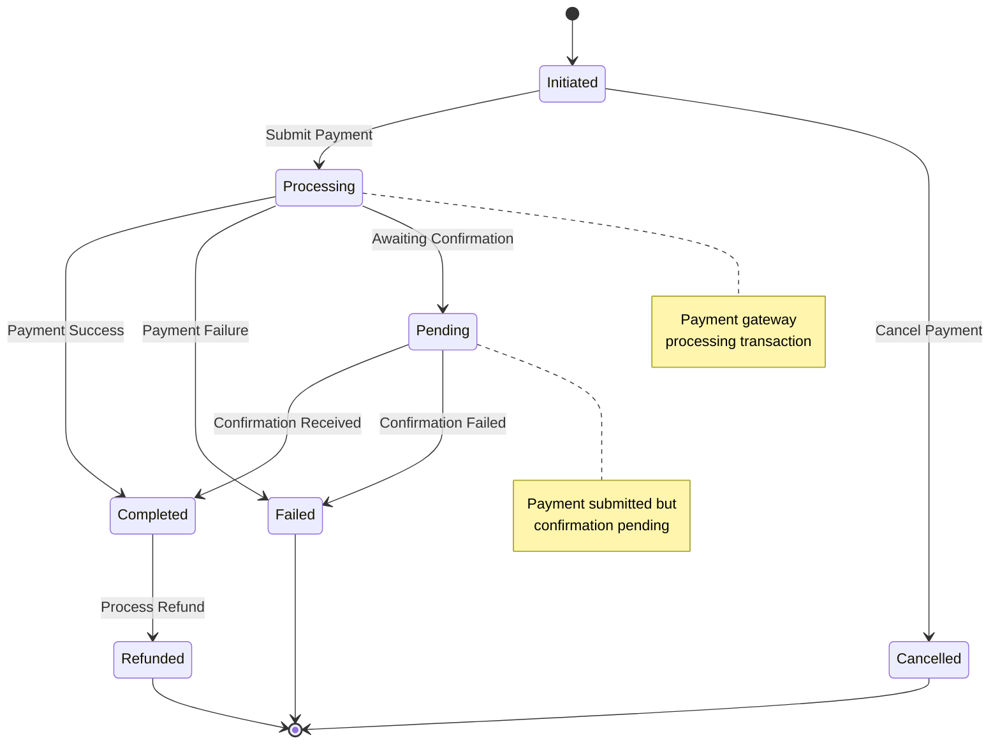
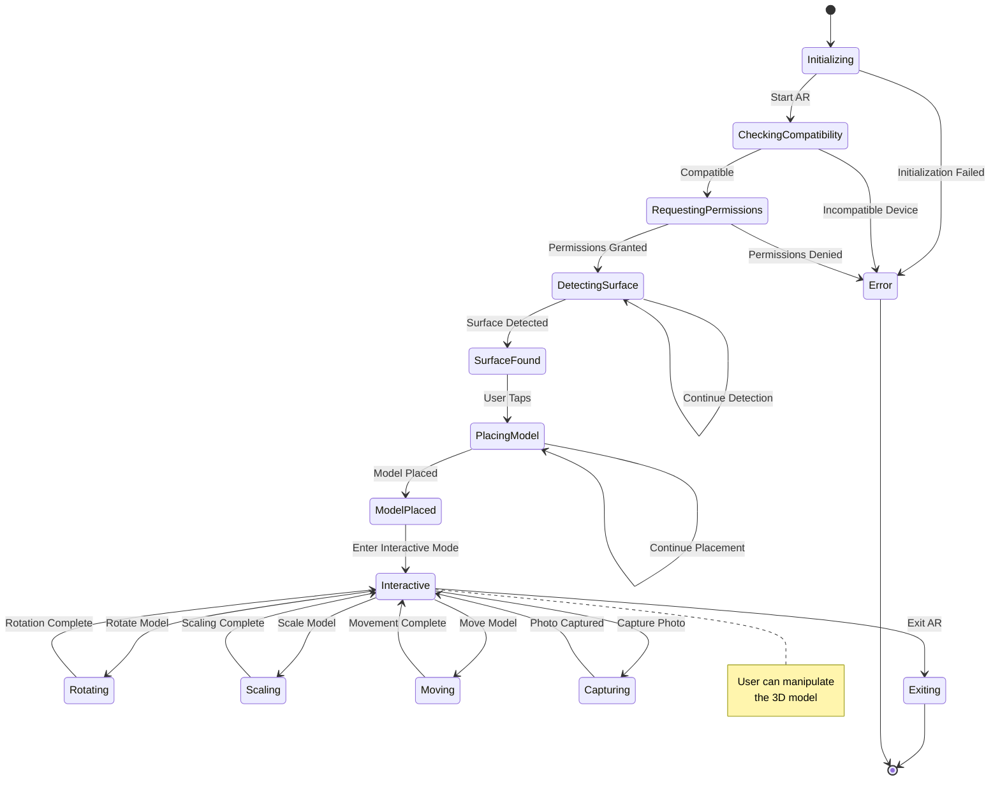
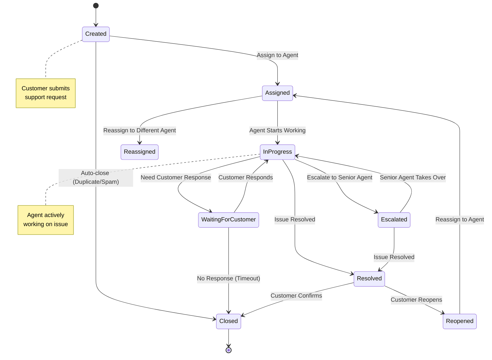
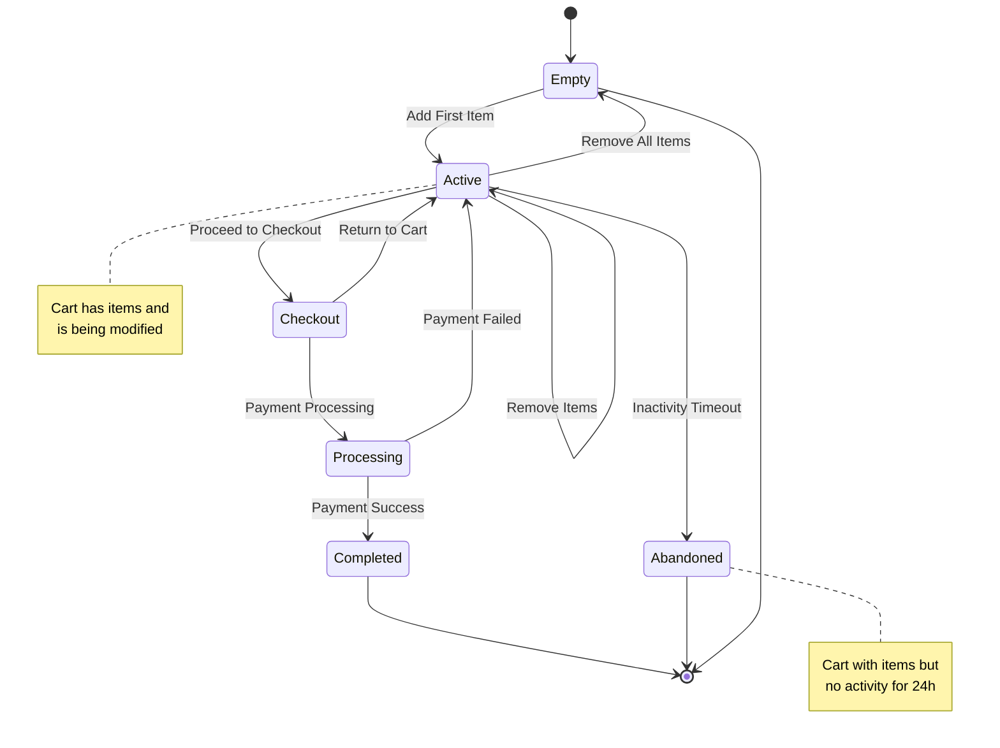

# State Chart Diagram - Augmented Reality Shopping App

## User Account State Chart

## Product State Chart

## Order State Chart

## Payment State Chart

## AR Session State Chart

## Support Ticket State Chart

## Shopping Cart State Chart

## State Chart Description

### User Account States:
- **Guest**: Unregistered user with limited access
- **Registered**: User account created but not logged in
- **LoggedIn**: Authenticated user session
- **Active**: User actively using the application
- **Inactive**: Session timeout, requires re-authentication
- **Suspended**: Account temporarily suspended
- **Deleted**: Account permanently removed

### Product States:
- **Draft**: Product created but not published
- **Active**: Available for purchase and AR try-on
- **Inactive**: Temporarily disabled
- **OutOfStock**: Visible but cannot be purchased
- **Discontinued**: Product no longer available

### Order States:
- **Pending**: Order placed, payment pending
- **Confirmed**: Payment received, order validated
- **Processing**: Items being prepared for shipping
- **Shipped**: Order dispatched with tracking
- **Delivered**: Successfully delivered to customer
- **Returned**: Customer returned the order
- **Refunded**: Money returned to customer
- **Completed**: Order fulfilled with feedback
- **Cancelled**: Order cancelled before shipping
- **Failed**: Payment failed, order not confirmed
- **Lost**: Order lost in transit

### Payment States:
- **Initiated**: Payment request created
- **Processing**: Payment gateway processing
- **Pending**: Awaiting confirmation
- **Completed**: Payment successful
- **Failed**: Payment failed
- **Refunded**: Payment returned to customer
- **Cancelled**: Payment cancelled

### AR Session States:
- **Initializing**: Starting AR session
- **CheckingCompatibility**: Validating device capabilities
- **RequestingPermissions**: Getting camera/sensor access
- **DetectingSurface**: Finding AR plane
- **SurfaceFound**: AR plane detected
- **PlacingModel**: User positioning 3D model
- **ModelPlaced**: 3D model positioned
- **Interactive**: User manipulating model
- **Exiting**: Ending AR session

### Support Ticket States:
- **Created**: Ticket submitted by customer
- **Assigned**: Assigned to support agent
- **InProgress**: Agent actively working
- **WaitingForCustomer**: Awaiting customer response
- **Escalated**: Moved to senior agent
- **Resolved**: Issue resolved
- **Reopened**: Customer reopened resolved ticket
- **Closed**: Ticket permanently closed

### Shopping Cart States:
- **Empty**: No items in cart
- **Active**: Items in cart, being modified
- **Checkout**: User proceeding to payment
- **Processing**: Payment being processed
- **Completed**: Purchase completed
- **Abandoned**: Cart with items but inactive

### Key State Transitions:
- **Triggers**: Events that cause state changes
- **Conditions**: Business rules for transitions
- **Actions**: Operations performed during transitions
- **Guards**: Validation checks before transitions 