# Use Case Diagram - Augmented Reality Shopping App

```mermaid
graph TB
    %% System Boundary Rectangle
    subgraph "Augmented Reality Shopping App System"
        %% Use Cases as ovals (represented as rounded rectangles)
        UC1([Register/Login])
        UC2([Browse Products])
        UC3([Search Product])
        UC4([View Product Details])
        UC5([Try in AR])
        UC6([Add to Cart])
        UC7([Check Out])
        UC8([Make Payment])
        UC9([Track Order])
        UC10([View Order History])
        UC11([Cancel Order])
        UC12([Chat Support])
        UC13([Submit Feedback])
        UC14([Manage Products])
        UC15([View Orders])
        UC16([Generate Reports])
    end

    %% Actors as stick figures (represented as circles with labels) - OUTSIDE system boundary
    USER((👤 User))
    ADMIN((👤 Admin))
    SUPPORT((👤 Customer Support))

    %% User Actor Connections
    USER --> UC1
    USER --> UC2
    USER --> UC3
    USER --> UC4
    USER --> UC5
    USER --> UC6
    USER --> UC7
    USER --> UC8
    USER --> UC9
    USER --> UC10
    USER --> UC11
    USER --> UC12
    USER --> UC13

    %% Admin Actor Connections
    ADMIN --> UC14
    ADMIN --> UC15
    ADMIN --> UC16

    %% Support Actor Connections
    SUPPORT --> UC12

    %% Include Relationships - MANDATORY
    UC3 -.->|"include"| UC4
    UC7 -.->|"include"| UC8

    %% Extend Relationships - OPTIONAL
    UC1 -.->|"extend"| UC10
    UC4 -.->|"extend"| UC5
    UC9 -.->|"extend"| UC12
    UC8 -.->|"extend"| UC11

    %% Styling for proper UML appearance
    classDef actor fill:#e8f5e8,stroke:#2e7d32,stroke-width:3px
    classDef usecase fill:#f3e5f5,stroke:#7b1fa2,stroke-width:2px
    classDef system fill:#f5f5f5,stroke:#333,stroke-width:3px,stroke-dasharray: 5 5

    class USER,ADMIN,SUPPORT actor
    class UC1,UC2,UC3,UC4,UC5,UC6,UC7,UC8,UC9,UC10,UC11,UC12,UC13,UC14,UC15,UC16 usecase
```

## Use Case Diagram Description

### **System Overview:**
The **Augmented Reality Shopping App** (enclosed in rectangle) allows users to browse products, try them in AR, make purchases, and get support. The system serves three types of actors: Users (customers), Admins (system managers), and Customer Support (help desk).

### **System Boundary:**
- **Rectangle Enclosure**: All use cases are contained within the system boundary
- **System Name**: "Augmented Reality Shopping App System" clearly labeled
- **External Actors**: All actors are positioned outside the system boundary
- **Internal Use Cases**: All functionality is contained within the boundary

### **Actors (Stick Figures - Outside System):**

#### **1. User (👤)**
- **Description**: Regular customers who shop and use AR features
- **Responsibilities**: Browse products, make purchases, use AR try-on, track orders
- **Primary Goals**: Find and purchase products with AR visualization

#### **2. Admin (👤)**
- **Description**: System administrators who manage the platform
- **Responsibilities**: Manage products, monitor orders, generate reports
- **Primary Goals**: Maintain product catalog and analyze business performance

#### **3. Customer Support (👤)**
- **Description**: Support staff who handle customer inquiries
- **Responsibilities**: Provide chat support, resolve issues
- **Primary Goals**: Help customers with their questions and problems

### **Use Cases (Oval Shapes - Inside System):**

#### **Authentication Use Cases:**
- **UC1: Register/Login** - User account creation and authentication

#### **Product Discovery Use Cases:**
- **UC2: Browse Products** - View product catalog
- **UC3: Search Product** - Find specific products
- **UC4: View Product Details** - See detailed product information
- **UC5: Try in AR** - Experience product in augmented reality

#### **Shopping Use Cases:**
- **UC6: Add to Cart** - Add products to shopping cart
- **UC7: Check Out** - Complete purchase process
- **UC8: Make Payment** - Process payment for orders

#### **Order Management Use Cases:**
- **UC9: Track Order** - Monitor order status
- **UC10: View Order History** - Access past orders
- **UC11: Cancel Order** - Cancel placed orders

#### **Support Use Cases:**
- **UC12: Chat Support** - Get help from customer support
- **UC13: Submit Feedback** - Provide product reviews and ratings

#### **Admin Use Cases:**
- **UC14: Manage Products** - Add, edit, delete products
- **UC15: View Orders** - Monitor all customer orders
- **UC16: Generate Reports** - Create business analytics reports

### **Include Relationships (MANDATORY):**

#### **1. UC3 (Search Product) includes UC4 (View Product Details)**
- **Description**: When a user searches for a product, they must view the product details
- **Reason**: Search results lead to detailed product information
- **Mandatory**: Yes, search cannot complete without viewing details

#### **2. UC7 (Check Out) includes UC8 (Make Payment)**
- **Description**: The checkout process must include payment processing
- **Reason**: Checkout cannot be completed without payment
- **Mandatory**: Yes, checkout requires payment

### **Extend Relationships (OPTIONAL):**

#### **1. UC1 (Register/Login) extends UC10 (View Order History)**
- **Description**: Login enables access to order history
- **Reason**: Users need to be logged in to view their past orders
- **Optional**: Users can login without viewing order history

#### **2. UC4 (View Product Details) extends UC5 (Try in AR)**
- **Description**: Product details page offers AR try-on option
- **Reason**: Users can optionally try products in AR from the details page
- **Optional**: Not all products may have AR capability

#### **3. UC9 (Track Order) extends UC12 (Chat Support)**
- **Description**: Order tracking can lead to support chat
- **Reason**: Users might need help while tracking their orders
- **Optional**: Users can track orders without contacting support

#### **4. UC8 (Make Payment) extends UC11 (Cancel Order)**
- **Description**: Payment enables order cancellation option
- **Reason**: After payment, users might want to cancel their order
- **Optional**: Not all payments lead to cancellations

### **UML Notation:**
- **System Boundary**: Rectangle containing all use cases
- **Actors**: Stick figures (👤) positioned outside the system boundary
- **Use Cases**: Ovals (rounded rectangles in Mermaid) inside the system boundary
- **Include**: Dashed line with "include" label (MANDATORY relationships)
- **Extend**: Dashed line with "extend" label (OPTIONAL relationships)
- **Association**: Solid line connecting actors to use cases

### **Relationship Types Explained:**
- **Include**: The base use case MUST include the included use case (mandatory)
- **Extend**: The base use case MAY extend to the extended use case (optional)
- **Association**: Direct connection between actor and use case

### **System Boundaries:**
- **Internal System**: Product catalog, user accounts, orders, AR functionality
- **External Systems**: Payment gateways, email services, SMS services, push notifications

### **Key Features:**
- **AR Integration**: Seamless AR try-on experience
- **Multi-platform Support**: Mobile and web interfaces
- **Real-time Support**: Live chat functionality
- **Comprehensive Order Management**: Full order lifecycle tracking
- **Admin Dashboard**: Complete business management tools 